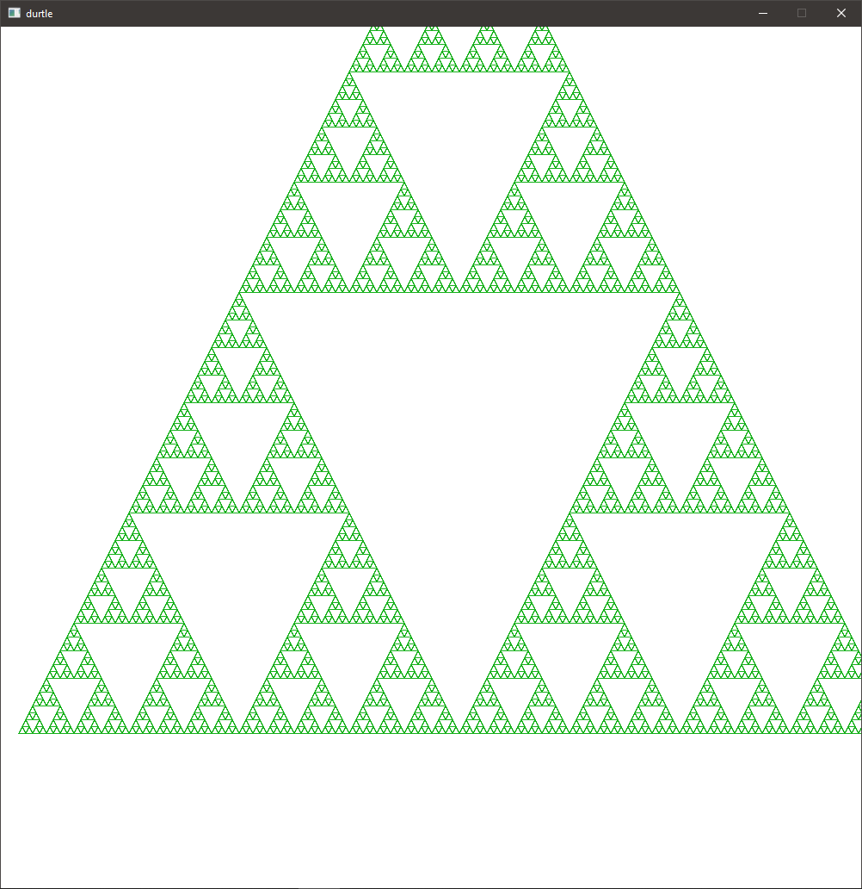
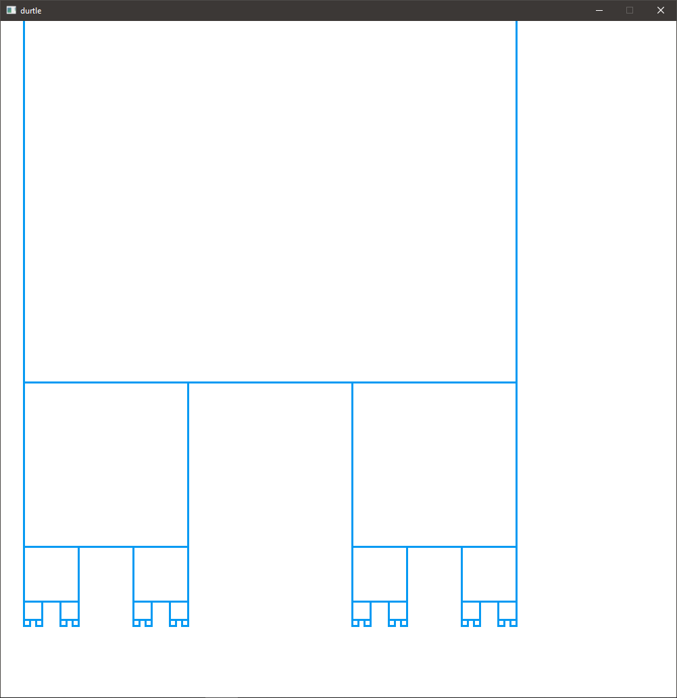
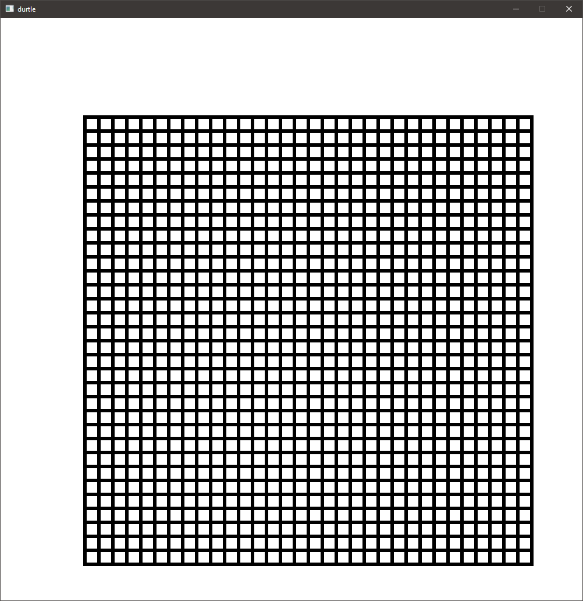
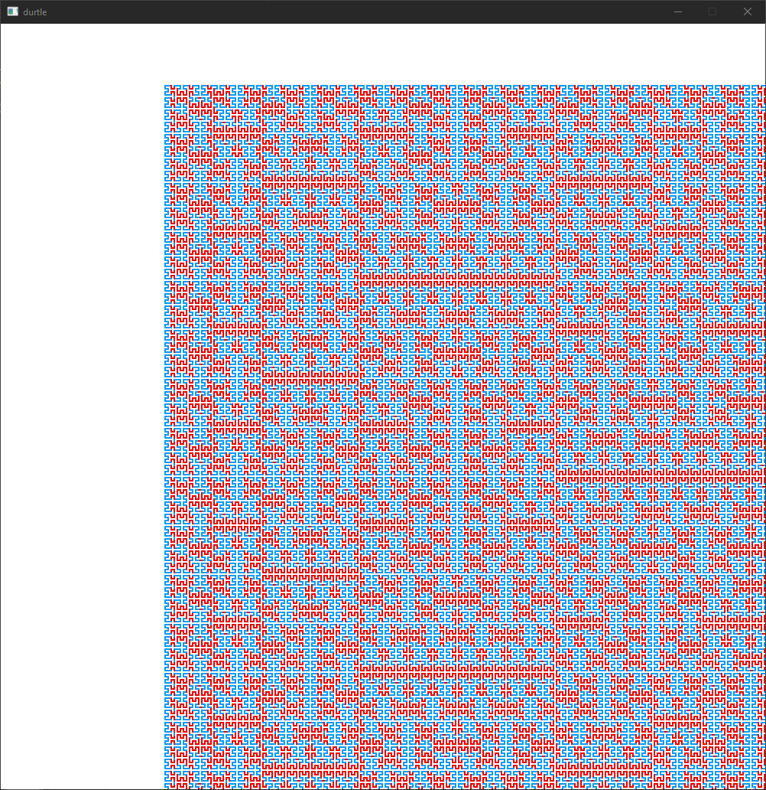

# Durtle

Implementation of a small language with turtle features in D.

Uses [raylib](https://github.com/raysan5/raylib) (via [raylib-d](https://code.dlang.org/packages/raylib-d)) for graphics, and [Pegged](https://github.com/dlang-community/Pegged) for parsing.

## Documentation

The language docs are available here: [durtle-docs](https://durtle.benrosenberg.info)

## Examples



```
`sierpinksi triangle` (~4;[>1^2]_[>1v2]_<*2;{#/2}1,>_.{#/2}1,</2^_.{#/2}1,</2v_.\)1.{g512}1
```



```
`cantor set` (~1;>_;v_>_<_{#/3}1>/3{#/3}1^_\)1.{a243}1
```



```
`grid` (~4;.>_v_<_^_,;{#/2}1>/2{#/2}1v/2{#/2}1</2{#/2}1^/2\)1{b128}1
```



```
`hilbert curve` (~0;_;~a;|1;|3\~a;{r-1}1;{a-1}1\^2~a;|3;|1\~a;{a-1}1;{r-1}1\^2~a;{a-1}1;{r-1}1\~a;|3;|1\^2~a;{r-1}1;{a-1}1\~a;|1;|3\\)1.{a8}1
```